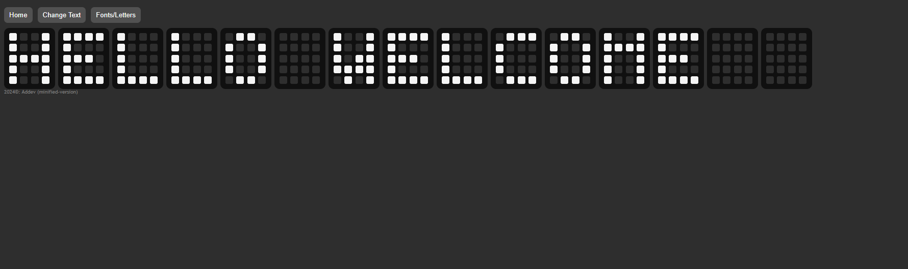

# Project Title

## Overview

Hello there! 👋 This project is a fun creation that I put together in just one day. When you explore this web-based digital text, you'll find it to be a delightful experience with playful animations. Think of it as a digital black and white clock but with a unique touch.

If you're interested in a similar design or just want to explore and play around with the code, feel free to grab it from this repository. It's a simple yet engaging project that you can use as a starting point for your own creative endeavors.


## Table of Contents

- [Features](#features)
- [Demo](#demo)
- [Installation](#installation)
- [Technologies Used](#technologies-used)
- [License](#license)

## Features

List the key features of your web-based digital text. You can include both functional and non-functional features. Consider using bullet points for better readability.

- Feature 1
- Feature 2
- Feature 3

## Demo

Check out the live demo to see the project in action!

[Live Demo](link_to_live_demo)



## Technologies Used

- HTML
- CSS
- JavaScript (Vanilla)


## Installation

Clone the repository and navigate to the project directory. To run the app, open the 'index.html' file in your web browser.

```bash
# Clone the repository
git clone https://github.com/your-username/your-repo.git

# Navigate to the project directory
cd your-repo

# Run the app:
# Simply open the 'index.html' file in your web browser
```

## License

This project is licensed under the [MIT License](https://opensource.org/licenses/MIT). See the [LICENSE](LICENSE) file for details.
